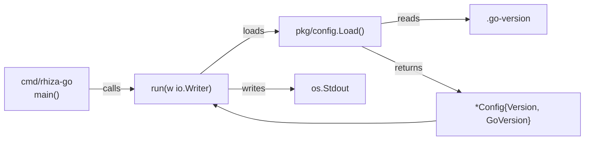
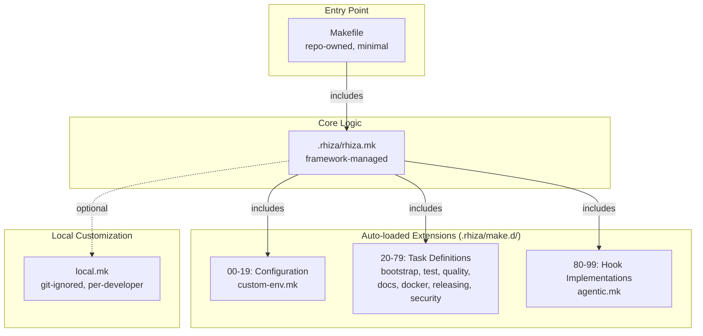
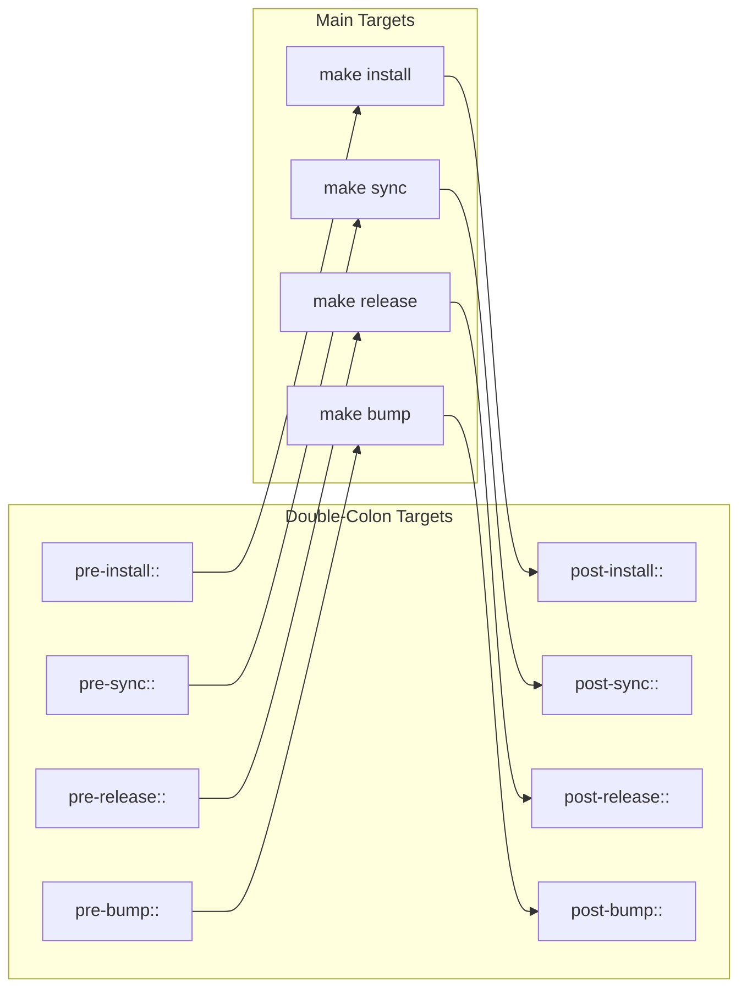
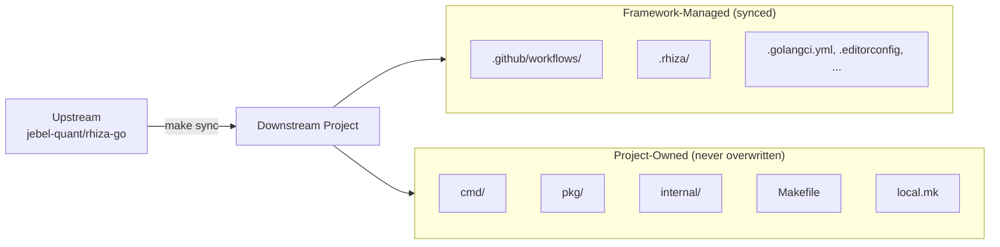
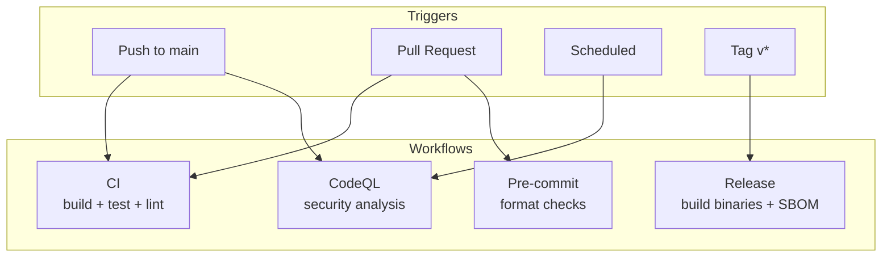
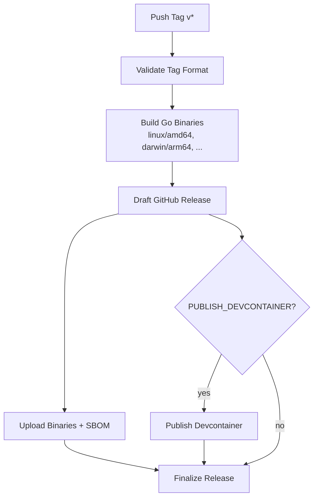
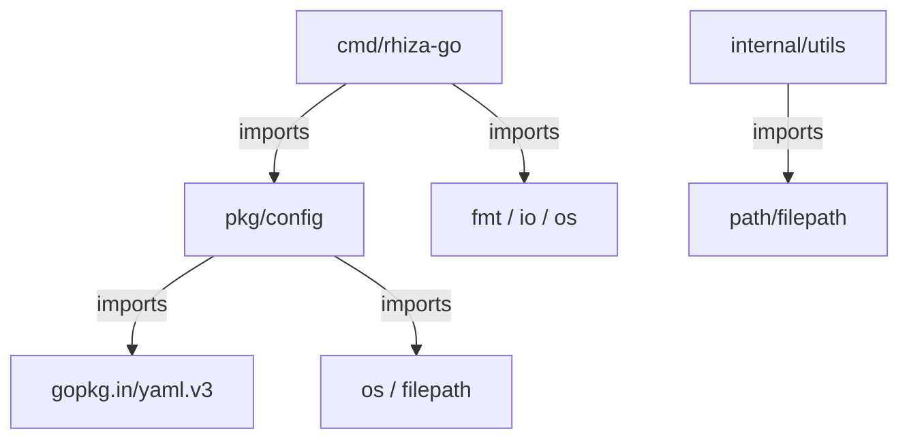

# Rhiza-Go Architecture

This document describes the architecture of Go projects built with the Rhiza framework — covering
the application layer design, the build and tooling system, and how they fit together.

---

## Design Philosophy

Rhiza-Go follows established Go conventions and idioms:

- **Standard project layout** — `cmd/`, `pkg/`, `internal/` separation of concerns.
- **Explicit over implicit** — configuration is loaded from well-known files, not environment magic.
- **Testability first** — entry points accept `io.Writer` for output, enabling deterministic tests.
- **Living template** — framework files (`.rhiza/`, workflows, configs) sync from the upstream
  template repository while application code (`cmd/`, `pkg/`, `internal/`) is fully owned by
  the downstream project.

---

## Application Layers

The Go application is organised into three layers with strict dependency rules:

```
cmd/        →  pkg/        →  (external deps)
  ↓                ↓
internal/   ←  (not imported by pkg/)
```

| Layer | Directory | Visibility | Purpose |
|-------|-----------|------------|---------|
| **Entry points** | `cmd/<app>/` | Binary | CLI main functions; wires dependencies and delegates to library code |
| **Public library** | `pkg/` | Exported | Reusable packages safe for external consumers to import |
| **Internal** | `internal/` | Private | Helper utilities scoped to this module; cannot be imported externally |

### `cmd/` — Application Entry Points

Each subdirectory under `cmd/` is a separate binary. The convention is:

- `main.go` defines `func main()` with minimal logic — just wiring and `os.Exit`.
- A `run(w io.Writer) error` function contains the real logic, returning errors instead of
  calling `os.Exit` directly. This makes the entry point fully testable.
- Dependencies flow inward: `cmd/` imports `pkg/` and `internal/`, never the reverse.

### `pkg/` — Public Library Packages

Packages here are the public API of the module. Any consumer can `go get` and import them.

| Package | Responsibility |
|---------|---------------|
| `pkg/config` | Load application configuration from well-known files (`.go-version`, `VERSION`). Parse template definitions from `.rhiza/template.yml`. |

Design rules for `pkg/`:

- Packages must not import from `internal/`.
- Each package should have a focused, single responsibility.
- Exported types use Go doc comments on every exported symbol.
- Errors are wrapped with `fmt.Errorf("context: %w", err)` for stack traceability.

### `internal/` — Private Utilities

Packages here are implementation details, invisible to external importers (enforced by Go's
`internal/` convention).

| Package | Responsibility |
|---------|---------------|
| `internal/utils` | General-purpose helpers: path sanitisation (`SanitizePath`), slice operations (`Contains`). |

Design rules for `internal/`:

- Keep packages small and focused.
- Move code to `pkg/` only when external consumers genuinely need it.
- Avoid deep nesting — one level under `internal/` is usually sufficient.

---

## Data Flow



1. `main()` calls `run(os.Stdout)`.
2. `run` calls `config.Load()` to build a `*Config` from on-disk files.
3. `config.Load()` reads `.go-version` for the Go version (defaults are baked in).
4. `run` formats and writes the output, returning any error to `main()`.
5. `main()` translates a non-nil error into `os.Exit(1)`.

---

## Configuration Model

Configuration is loaded from static project files rather than environment variables:

| Source | Field | Default |
|--------|-------|---------|
| Hardcoded | `Config.Version` | Read from `VERSION` file or defaults to `"0.1.0"` |
| `.go-version` | `Config.GoVersion` | `"1.23"` if file is missing |
| `.rhiza/template.yml` | `Template.Repository`, `Ref`, `Include`, `Exclude` | Loaded on demand via `LoadTemplate()` |

`LoadTemplate` includes path-traversal protection — relative paths that escape the project root
are rejected before any file I/O occurs.

---

## Testing Strategy

Tests live alongside the code they test (`_test.go` in the same package):

| Pattern | Example | Purpose |
|---------|---------|---------|
| **Testable main** | `TestRun` in `cmd/rhiza-go/main_test.go` | Verifies CLI output without spawning a process |
| **Table-driven tests** | `TestSanitizePath`, `TestLoadTemplate_PathTraversal` | Covers edge cases systematically |
| **Temp directories** | `t.TempDir()` in config tests | Hermetic filesystem tests with automatic cleanup |
| **No mocks for I/O** | `run(w io.Writer)` | Inject a `bytes.Buffer` instead of mocking `os.Stdout` |

Tests run via `make test`, which enables race detection (`-race`) and coverage reporting.

---

## Build System Architecture

The build system is a layered Makefile structure managed by the Rhiza framework.

### Makefile Hierarchy



| File | Owner | Synced? | Role |
|------|-------|---------|------|
| `Makefile` | Project | No | Thin entry point; includes `.rhiza/rhiza.mk` |
| `.rhiza/rhiza.mk` | Framework | Yes | Core targets: `help`, `sync`, `validate`, `version-matrix` |
| `.rhiza/make.d/*.mk` | Framework | Yes | Modular extensions loaded by numeric prefix order |
| `local.mk` | Developer | No | Per-machine overrides (not committed) |

### Key Make Targets

| Target | Extension | What it does |
|--------|-----------|-------------|
| `make install` | `bootstrap-go.mk` | Verify Go version, `go mod download`, install tools |
| `make build` | `bootstrap-go.mk` | `go build` to `bin/` |
| `make test` | `test.mk` | `go test -race -cover ./...` with reports |
| `make fmt` | `quality.mk` | `go fmt`, `goimports`, `golangci-lint --fix` |
| `make lint` | `quality.mk` | `golangci-lint run` (25+ linters via `.golangci.yml`) |
| `make release` | `releasing.mk` | Version bump, tag, push |
| `make sync` | `rhiza.mk` | Pull upstream template changes |
| `make book` | `book.mk` | Generate documentation site |
| `make clean` | `bootstrap.mk` | Remove build artifacts and stale branches |

### Hook System

All lifecycle targets support double-colon `pre-` and `post-` hooks for project-level customisation:



Hooks are defined in the project `Makefile` using double-colon syntax (`target::`) to allow
multiple definitions without overriding the framework defaults.

---

## Template Sync Model

Rhiza-Go is a **living template** — downstream projects stay in sync with the upstream framework
while retaining full ownership of application code.



The sync boundary is defined in `.rhiza/template.yml` via `include` and `exclude` patterns.

---

## Directory Structure

```
.
├── cmd/                        # Application entry points (one dir per binary)
│   └── rhiza-go/
│       ├── main.go             #   CLI wiring and os.Exit
│       └── main_test.go        #   Entry point tests
├── pkg/                        # Public library packages
│   └── config/
│       ├── config.go           #   Config loading and template parsing
│       └── config_test.go      #   Config tests with path traversal coverage
├── internal/                   # Private internal packages
│   └── utils/
│       ├── utils.go            #   Path sanitisation, slice helpers
│       └── utils_test.go       #   Utils tests
├── docs/                       # Documentation source (MkDocs)
├── docker/                     # Dockerfile and build context
├── .rhiza/                     # Framework configuration (synced)
│   ├── rhiza.mk                #   Core Makefile logic
│   ├── make.d/                 #   Modular Makefile extensions
│   ├── scripts/                #   Shell scripts
│   └── template.yml            #   Sync configuration
├── .github/                    # GitHub Actions workflows and hooks
├── Makefile                    # Thin entry point (project-owned)
├── go.mod                      # Go module definition
├── .go-version                 # Go version (single source of truth)
├── .golangci.yml               # Linter configuration (25+ linters)
└── VERSION                     # Project version
```

---

## CI/CD Pipeline



### Release Pipeline



---

## Dependency Graph



The module has a single external dependency (`gopkg.in/yaml.v3`) for YAML parsing. All other
imports are from the Go standard library, keeping the dependency footprint minimal.

---

## Adding New Packages

When extending the application:

1. **New binary** — create `cmd/<name>/main.go` with a testable `run()` function.
2. **New public package** — add under `pkg/<name>/` with doc comments on all exports.
3. **New internal package** — add under `internal/<name>/` for implementation details.
4. **New Make target** — add to `Makefile` or a `local.mk` file (never edit `.rhiza/` directly).
5. **New dependency** — `go get <module>` then `go mod tidy`.

Always follow the dependency rule: `cmd/ → pkg/ → external`, `cmd/ → internal/`, never
`pkg/ → internal/` or `internal/ → cmd/`.
